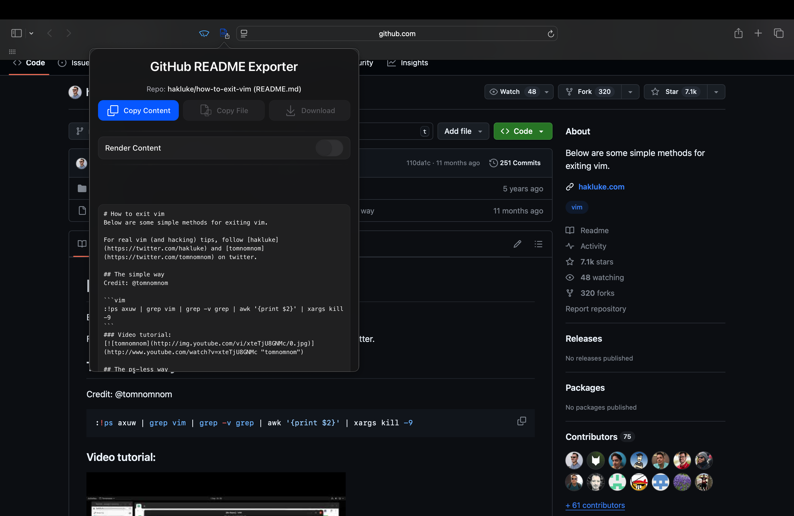
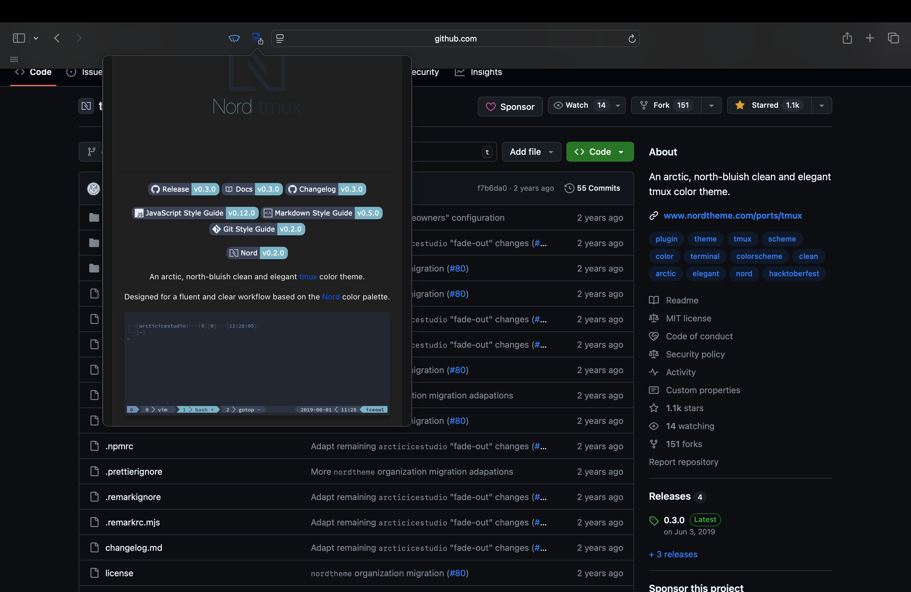

<div align="center">


<h1>GitHub README Exporter</h1>

A lightweight Safari Web Extension for macOS that streamlines the extraction, copying, and rendering of GitHub README files. Designed for seamless integration into AI workflows, summarization pipelines, or rapid developer reference.

[](https://www.gnu.org/licenses/gpl-3.0) [](https://developer.apple.com/safari/extensions/) [](https://github.com/kgruiz/github-readme-exporter/issues)

</div>

---

## Demo

<div align="center">
  
  <p><em>Unrendered Markdown view</em></p>

  <br/>

  
  <p><em>Rendered Markdown view</em></p>
</div>

--- --

## Features

- **Seamless Integration**
  Contextual activation on GitHub repository pages.

- **Instant Retrieval**
  One-click access to the primary README.

- **Dual View Modes**
  Toggle between raw Markdown and rendered HTML using `marked.js`.

- **One-Click Copy**
  Copy raw Markdown to clipboard for documentation or AI pipelines.

- **Adaptive UI**
  Automatically matches system light and dark modes.

> **Note:** “Copy as File” and “Download” are implemented in code but not exposed due to Safari Web Extension constraints.

---

## Installation

```bash
git clone https://github.com/kgruiz/github-readme-viewer.git
cd github-readme-viewer
open github-readme-viewer.xcodeproj
# Build (⌘B) and Run (⌘R) once to register the extension
````

Enable in Safari ▸ Settings ▸ Extensions ▸ **GitHub README Exporter**

---

## Usage

1. Navigate to any GitHub repository in Safari.
2. Click the extension’s toolbar icon.
3. Toggle between raw and rendered views.
4. Click **Copy Content** to copy the Markdown.

---

## Architecture

- **macOS Host App**: Swift & Cocoa container
- **Safari Web Extension**: HTML, CSS, JavaScript with `marked.js`
- **API**: GitHub REST “Get Repository README” endpoint

---

## Contributing

1. Fork the repository and create a branch (`feature/...` or `fix/...`).
2. Implement changes with a clear commit message.
3. Submit a pull request against `main`.

---

## License

This project is licensed under the GNU General Public License v3.0. See the [LICENSE](LICENSE) file for details.
